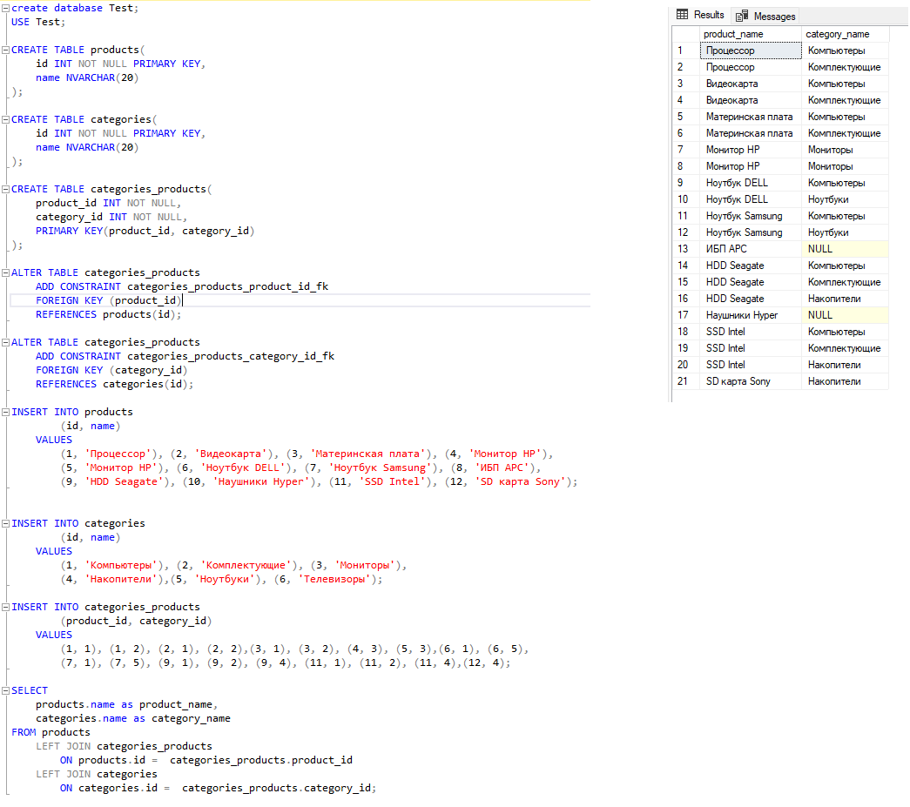

# Тестирование
---

### Вопрос 1:

В рамках курсового проекта была разработана система сбора метрик компьютера. Проект представляет собой приложения ASP.NET Core Web API. 
Графический интерфейс реализован как SPA React приложение.

[https://github.com/orlfi/Metrics](https://github.com/orlfi/Metrics)

Так же имелся опыт создания информационной системы для учета электроэнергии, подготовки отчетности, обмена данными с регуляторами (Администратор торговой системы, Системный оператор и др.) в сбытовой компании. Серверная часть выполнена в виде ASP Net приложения. Клиентская часть выполнена в виде SPA приложения с использованием библиотек Sencha. 

---

### Вопрос 2: 
C# библиотека для вычисления площадей фигур:

[FigureLibrary](https://github.com/orlfi/Testing/tree/main/FigureLibrary)

Основные функции проекта:
1. Рассчитывает площадь круга и треугольника.
2. Для треугольника добавлена проверка на то, что является ли треугольник прямоугольным.
3. Позволяет легко добавлять другие фигуры, отнаследовавшись от базового класса Figure. Для примера добавлены расчет площади прямоугольника и квадрата в консольном проекте. Так же в примере показано вычисление фигуры без знания ее типа в compile-time.
4. Разработатны Юнит-тесты библиотеки.

---

### Вопрос 3: 
В рамках тестового задания №3:
1. Создана база данных MS SQL Server `Test`. 
2. Добавлены таблицы:
    - `products` - продукты
    - `categories` - категории
    - `categories-products` - связь многие-ко-многим продуктов и категорий
3. Написан запрос для выбора всех пар «Имя продукта – Имя категории». Если у продукта нет категорий, то его имя все равно выводится.

[SQL cкрипт](https://github.com/orlfi/Testing/blob/main/SQL/products_and_categories.sql)

---

### Вопрос 4:
Готов выйти на фуллтайм удаленно.
